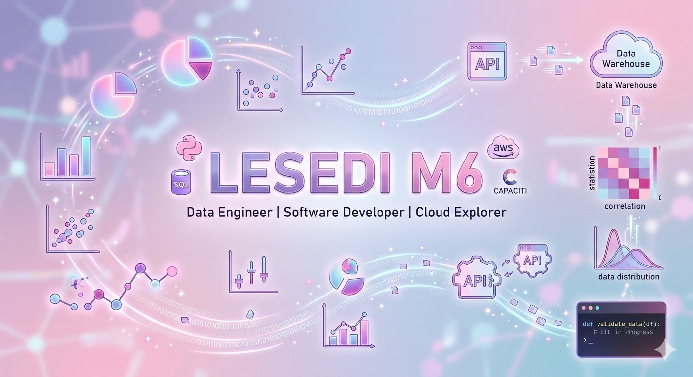

# Hi, I'm Lesedi Mphachake! 👋

  

I am a **Software Developer** passionate about building robust systems that turn raw data into actionable insights.

 **I’m currently exploring**: Python scripts to validate data integrity before loading into Data Warehouses and Machine Learning models.
- **I’m currently learning**: Cloud systems like AWS, Azure, and Advanced SQL.
- ⚙️ **Passionate about**: Building automated ETL pipelines to scrape, clean, and load data from public APIs.

---

## CAPACITI Data Analytics Journey
I am currently undergoing an intensive Data Analytics program at **CAPACITI**, bridging the gap between Software Engineering and Data Science.

- **The "Data Drifters" Lead**: Collaborating on group projects to solve real-world data challenges and versioning data assets.
- **Standardization**: Implementing SFIA standards in all technical documentation.

---

##  Skills & Tech Stack

### Languages
     

### Data & Analytics
   

### Frontend & Backend
    

### Cloud & Platforms
  

---

##  GitHub Stats & Activity

  
  

  

---

---

## Featured Projects

### [ Fraud Sentinel Pipeline](https://github.com/LesediM6/FNB-Fraud-Sentinel-Pipeline)

> **Data Engineering & Security:** A robust data pipeline designed to detect and flag fraudulent transactions in real-time. Built to ensure data integrity for banking systems.

### [Retail Customer Intelligence](https://github.com/LesediM6/Retail-Customer-Intelligence)

> **Market Analysis:** Advanced analytics platform focusing on customer behavior and purchase patterns to drive retail decision-making through data-driven insights.

###  [Personal Portfolio](https://github.com/LesediM6/lesedi-portfolio-main)

> **Web Development:** My professional landing page and project showcase, built with modern web technologies and hosted on Vercel.

---

---

##  Connect with Me

---

  <i>"Transforming raw data into robust solutions, one commit at a time."</i>

